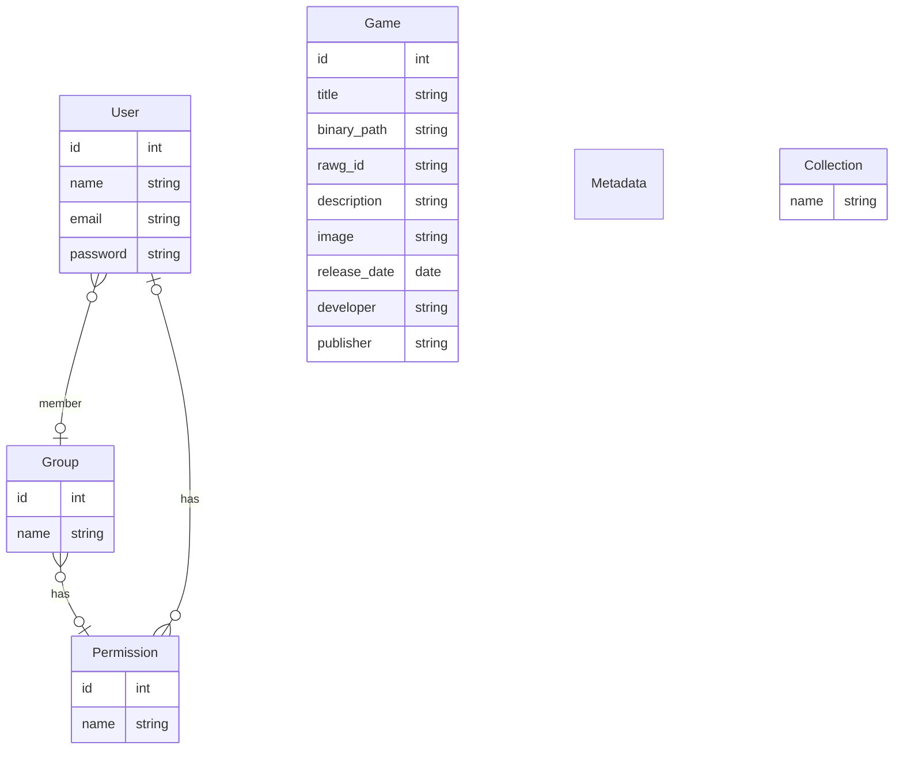
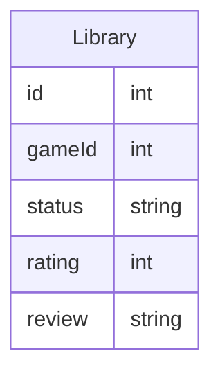

# Database

This document describes the model specification of the database using mermaid diagrams.

## Server

```mermaid
erDiagram

    %% Users & Permissions

    User {
        id int
        name string
        email string
        password string
    }

    Group {
        id int
        name string
    }

    Permission {
        id int
        name string
    }

    User }o--|o Group : member
    Group }o--|o Permission : has
    User o|--o{ Permission : has    

    %% Library

    Game {
        id int
        title string
        binary_path string
        rawg_id string
        description string
        image string
        release_date date
        developer string
        publisher string
    }

    Metadata {

    }

    Collection {
        name string
    }
```

## Client

```mermaid
erDiagram

    Library {
        id int
        gameId int
        status string
        rating int
        review string
    }

```